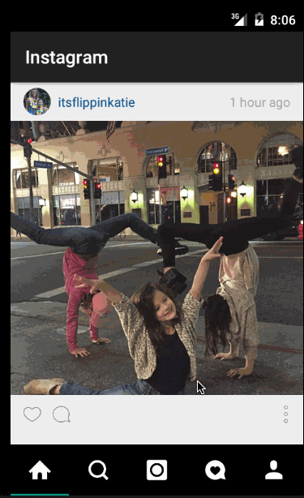

# android-instagram

This is an Android Instagram Client

Time spent: 5 hours spent in total

Completed user stories:
* [x] Add pull-to-refresh for the home feed with SwipeRefreshLayout.
* [x] User can open the Instagram client offline and see last loaded feed.
* [x] Each media item is persisted into SQlite and can be displayed from the local DB.
* [x] Create a background service to make the network request, load items into the DB and populate the view (for the user's home feed).

GIF created with [LiceCap](http://www.cockos.com/licecap/).

