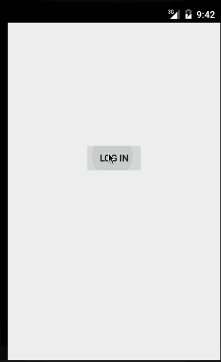

# android-instagram

This is an Android Instagram Client

Time spent: 10 hours spent in total

Completed user stories:
* [x] User can login to Instagram using OAuth login.
* [x] User can view their own feed.
* [x] User can search for a user by username.
* [x] User can search for a tag.
* [x] On the search screen, there will now be 2 tabs corresponding to "USERS" and "TAGS".
* [x] When performing a search, the user can switch between the "USERS" tab and the "TAGS" tab and see search results for each one.

GIF created with [LiceCap](http://www.cockos.com/licecap/).

