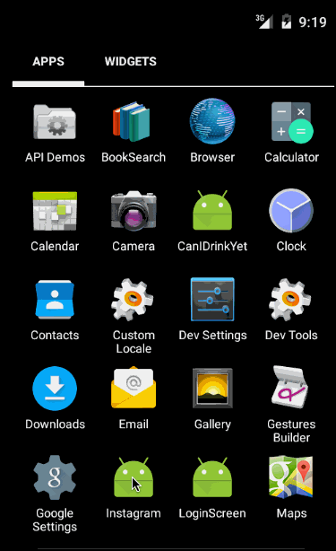

# android-instagram

This is an Android Instagram Client

Time spent: 10 hours spent in total

Completed user stories:
* [x] Connect the app with the Instagram API and get real time data using async-http-client library.
* [x] Show the last 2 comments for each photo.
* [x] User can view all comments for a post within a separate activity.
* [x] User can share an image to their friends or email to themselves.

GIF created with [LiceCap](http://www.cockos.com/licecap/).

